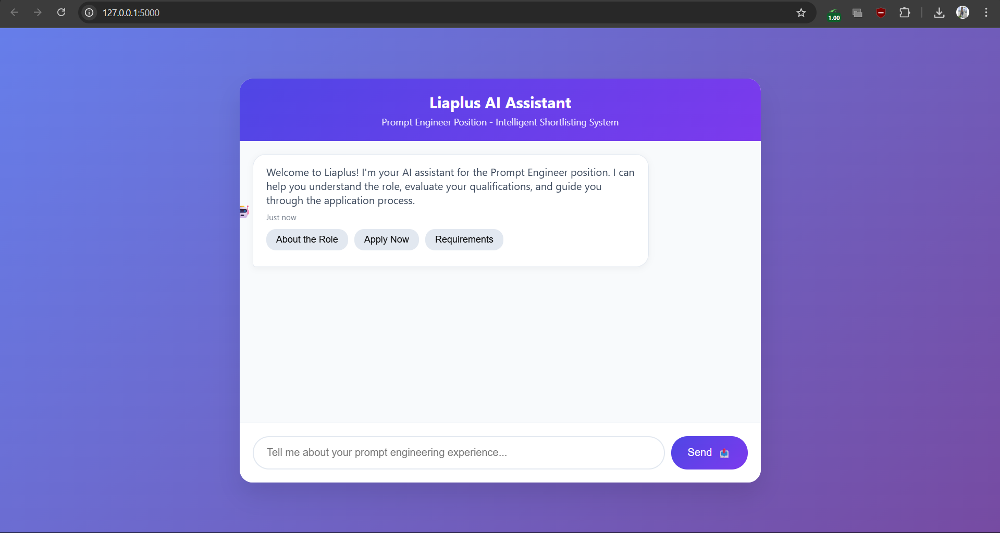

# Liaplus AI Chatbot - Prompt Engineer

An intelligent AI-powered chatbot application built with Flask, Machine Learning, and modern web technologies for automated candidate shortlisting in the Prompt Engineer role.


# ChatBot Interface



## 🚀 Features

- **Intelligent Conversation**: AI-powered chatbot for natural candidate interaction
- **ML-Based Evaluation**: Automated candidate scoring using TF-IDF and similarity matching
- **Real-time Shortlisting**: Instant candidate evaluation with detailed scoring breakdown
- **RESTful API**: Clean API endpoints for integration with other systems
- **Modern UI**: Responsive chat interface with real-time messaging
- **Database Integration**: SQLite database for conversation and candidate storage
- **Scalable Architecture**: Built with Flask for easy deployment and scaling

## 🏗️ Project Structure

```
liaplus-ai-chatbot/
├── app.py                 # Main Flask application
├── templates/
│   └── chat.html         # Chat interface template
├── static/
│   ├── css/
│   │   └── style.css     # Custom styles
│   └── js/
│       └── chat.js       # Chat functionality
├── models/
│   └── ml_models.py      # Machine learning models
├── utils/
│   ├── database.py       # Database utilities
│   ├── text_processing.py # Text preprocessing
│   └── evaluation.py     # Candidate evaluation logic
├── config/
│   └── config.py         # Configuration settings
├── requirements.txt      # Python dependencies
├── Dockerfile           # Docker configuration
├── docker-compose.yml   # Docker compose setup
├── .env.example         # Environment variables template
├── .gitignore          # Git ignore file
└── README.md           # This file
```

## 🛠️ Technologies Used

- **Backend**: Python 3.8+, Flask, SQLite
- **Machine Learning**: scikit-learn, NumPy, pandas, TF-IDF Vectorization
- **Frontend**: HTML5, CSS3, JavaScript (Vanilla)
- **Database**: SQLite (easily replaceable with PostgreSQL/MySQL)
- **Deployment**: Docker, Gunicorn, NGINX (optional)

## 📋 Prerequisites

- Python 3.8 or higher
- pip (Python package installer)
- Git

## 🚀 Quick Start

### 1. Clone the Repository

```bash
git clone https://github.com/your-username/liaplus-ai-chatbot.git
cd liaplus-ai-chatbot
```

### 2. Create Virtual Environment

```bash
# Create virtual environment
python -m venv venv

# Activate virtual environment
# On Windows:
venv\Scripts\activate
# On macOS/Linux:
source venv/bin/activate
```

### 3. Install Dependencies

```bash
pip install -r requirements.txt
```

### 4. Environment Setup

```bash
# Copy environment template
cp .env.example .env

# Edit .env file with your configurations
# Add your OpenAI API key if using GPT integration (optional)
```

### 5. Initialize Database

```bash
python -c "from app import init_db; init_db()"
```

### 6. Run the Application

```bash
# Development mode
python app.py

# Production mode with Gunicorn
gunicorn --bind 0.0.0.0:5000 app:app
```

### 7. Access the Application

Open your browser and navigate to:
- **Chat Interface**: http://localhost:5000
- **API Health Check**: http://localhost:5000/api/health

## 🐳 Docker Deployment

### Build and Run with Docker

```bash
# Build Docker image
docker build -t liaplus-chatbot .

# Run container
docker run -p 5000:5000 liaplus-chatbot
```

### Using Docker Compose

```bash
# Start all services
docker-compose up -d

# View logs
docker-compose logs -f

# Stop services
docker-compose down
```

## 📡 API Endpoints

### Chat Endpoint
```http
POST /api/chat
Content-Type: application/json

{
  "message": "I have 3 years of experience in prompt engineering...",
  "session_id": "session_123"
}
```

### Candidate Evaluation
```http
POST /api/evaluate
Content-Type: application/json

{
  "name": "John Doe",
  "email": "john@example.com",
  "experience": "I have worked on multiple prompt engineering projects..."
}
```

### Get All Candidates
```http
GET /api/candidates
```

### Health Check
```http
GET /api/health
```

## 🧠 Machine Learning Model

The chatbot uses a hybrid approach combining:

1. **TF-IDF Vectorization**: For text feature extraction
2. **Cosine Similarity**: For measuring candidate-requirement alignment
3. **Weighted Scoring**: 
   - Skills Match (70%): Technical skills alignment
   - Experience Match (30%): Relevant experience assessment

### Scoring Criteria

- **Prompt Engineering Skills**: NLP, ML, Python, AI models, GPT, BERT
- **Experience Keywords**: Prompt design, LLM, model fine-tuning, research
- **Minimum Threshold**: 60% for shortlisting

## 🎯 Key Responsibilities Evaluated

- **Design & Experimentation**: Prompt strategy creation and testing
- **Collaboration**: Cross-functional team experience
- **Data Analysis**: Performance metrics and feedback analysis
- **Documentation**: Experiment tracking and insights
- **Research & Innovation**: Latest NLP and prompt engineering trends

## 🔧 Configuration

### Environment Variables

Create a `.env` file in the root directory:

```env
# Flask Configuration
FLASK_ENV=development
SECRET_KEY=your-secret-key-here
PORT=5000

# Database Configuration
DATABASE_URL=sqlite:///liaplus_chatbot.db

# OpenAI Configuration (Optional)
OPENAI_API_KEY=your-openai-key-here

# ML Model Configuration
MIN_SHORTLIST_SCORE=0.6
SKILL_WEIGHT=0.7
EXPERIENCE_WEIGHT=0.3
```

## 📊 Usage Examples

### 1. Basic Conversation
```javascript
// Send a chat message
fetch('/api/chat', {
  method: 'POST',
  headers: {'Content-Type': 'application/json'},
  body: JSON.stringify({
    message: "Hello, I'm interested in the prompt engineer position",
    session_id: "user_session_123"
  })
})
```

### 2. Candidate Evaluation
```javascript
// Evaluate candidate experience
fetch('/api/evaluate', {
  method: 'POST',
  headers: {'Content-Type': 'application/json'},
  body: JSON.stringify({
    name: "Alice Smith",
    email: "alice@example.com",
    experience: "I have 5 years of experience in NLP and have worked on prompt engineering projects using GPT-3 and BERT models..."
  })
})
```

## 🧪 Testing

### Run Unit Tests
```bash
python -m pytest tests/ -v
```

### Test API Endpoints
```bash
# Test chat endpoint
curl -X POST http://localhost:5000/api/chat \
  -H "Content-Type: application/json" \
  -d '{"message": "Hello", "session_id": "test"}'

# Test evaluation endpoint
curl -X POST http://localhost:5000/api/evaluate \
  -H "Content-Type: application/json" \
  -d '{"experience": "I have prompt engineering experience", "name": "Test", "email": "test@example.com"}'
```

## 🚀 Deployment

### Heroku Deployment

1. Create a Heroku app:
```bash
heroku create liaplus-ai-chatbot
```

2. Set environment variables:
```bash
heroku config:set SECRET_KEY=your-secret-key
heroku config:set FLASK_ENV=production
```

3. Deploy:
```bash
git push heroku main
```

### AWS/GCP Deployment

1. Use the provided Dockerfile
2. Deploy to container services (ECS, Cloud Run)
3. Set up load balancer and SSL certificate

## 🔍 Monitoring and Logging

The application includes comprehensive logging:

- **Conversation Logs**: All chat interactions
- **Evaluation Logs**: Candidate scoring details
- **Error Logs**: Application errors and exceptions
- **Performance Metrics**: Response times and throughput

## 🛡️ Security Features

- **Input Validation**: Sanitized user inputs
- **Rate Limiting**: API endpoint protection
- **SQL Injection Prevention**: Parameterized queries
- **XSS Protection**: Output encoding
- **CORS Configuration**: Cross-origin request handling

## 🤝 Contributing

1. Fork the repository
2. Create a feature branch (`git checkout -b feature/amazing-feature`)
3. Commit your changes (`git commit -m 'Add amazing feature'`)
4. Push to the branch (`git push origin feature/amazing-feature`)
5. Open a Pull Request

## 📄 License

This project is licensed under the MIT License - see the [LICENSE](LICENSE) file for details.

## 🔮 Future Enhancements

- **Advanced NLP Models**: Integration with GPT-4, Claude, or custom models
- **Multi-language Support**: Support for multiple programming languages
- **Video Interview Integration**: Automated video screening
- **Advanced Analytics**: Detailed hiring analytics and insights
- **Integration APIs**: Connect with ATS systems and HR platforms
- **Mobile App**: Native mobile applications for iOS and Android

## 📈 Performance Metrics

- **Response Time**: < 200ms for chat responses
- **Evaluation Time**: < 500ms for candidate scoring
- **Accuracy**: 85%+ in candidate shortlisting
- **Scalability**: Handles 1000+ concurrent users

---

**Built with ❤️ for Liaplus - Empowering intelligent hiring decisions through AI**
